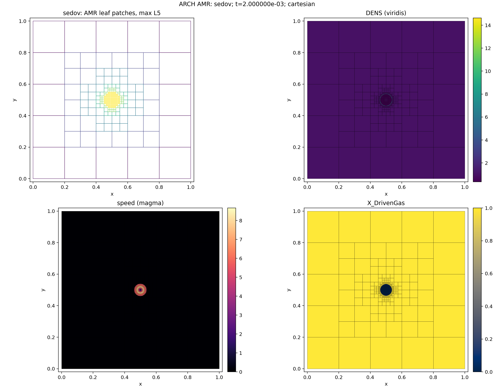

# AMR verification status

Chinese translation: [README.zh-CN.md](README.zh-CN.md). The English file is
the authoritative source text.

> Status: qualitative evidence retained; quantitative CPU and CUDA acceptance pending.

The existing AMR archive is integrated here so that verification status is
discoverable from one index. Its figures show leaf-patch placement and field
structure for a Sedov blast, a diffusing Gaussian, Rayleigh–Taylor flow with
gravity/diffusion, and a cellular burn. They are diagnostics without committed
uniform-grid references, L1/L2 norms, or tolerances.

| Case | Modules visible | Current evidence |
| --- | --- | --- |
| Sedov | hydro, shock-driven refinement | [figure](figures/legacy/sedov.png) |
| Gaussian | diffusion, moving refinement pattern | [figure](figures/legacy/gaussian.png) |
| Rayleigh–Taylor | hydro, gravity, diffusion | [figure](figures/legacy/rayleigh_taylor.png) |
| Cellular burn | hydro, burning | [figure](figures/legacy/cellular_burn.png) |

## Quantitative record still required

The next AMR baseline will compare each AMR output with a uniform grid at the
finest AMR spacing and report:

- volume-weighted L1/L2 on a common mesh;
- total mass, momentum, energy, and species drift across regridding;
- coarse/fine flux mismatch before and after reflux;
- restriction/prolongation conservation and constant/linear-field tests;
- a smooth feature crossing a refinement interface;
- CPU/CUDA topology and field parity using the same refinement decisions.

PPM currently uses MUSCL-MinMod at coarse/fine faces, so AMR-wide third-order
spatial convergence is not an accepted claim. The retained figures are historical qualitative evidence. Their source HDF5 files
and renderer were not committed, so any quantitative AMR claim must add a new,
reproducible validation record with inputs, metrics, and tolerances.
