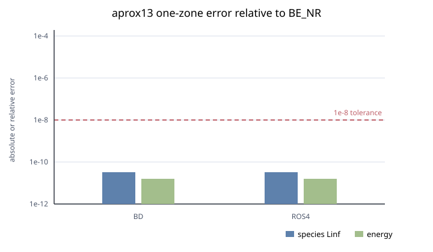

# aprox13 one-zone burn

Chinese translation: [README.zh-CN.md](README.zh-CN.md). The English file is
the authoritative source text.

> CPU status: BD and ROS4 pass the current cross-solver tolerance. CUDA: pending.

The `BurnOneZone` implementation remains in `simulation/BurnOneZone/`; the
immutable parameter files owned by this record are in [`inputs/`](inputs/).
They run the production burn driver at
\(\rho=10^7\,\mathrm{g\,cm^{-3}}\), \(T=3\times10^9\,\mathrm{K}\), initial
`C12=0.5`, `O16=0.5`, and \(t=10^{-10}\,\mathrm{s}\). The strict BE_NR input
(`rtol=1e-10`, `atol=1e-14`) supplies an internal converged reference; BD and
ROS4 use `rtol=1e-6`, `atol=1e-10`. This is solver cross-verification, not an
independent physical validation of aprox13 rates.

## Helmholtz table identity

The only source used for this record is the `helm_table.dat` member of the
`helmholtz.tar.xz` package downloaded from the
[Timmes EOS website](https://cococubed.com/code_pages/eos.shtml). The runtime
path is `EOS_toolkit/tables/helmholtz/helm_table.dat`; Git LFS must
materialize it before the run.

| Property | Required value |
| --- | --- |
| Table shape | 541 density rows × 201 temperature columns |
| File size | 60,242,514 bytes |
| SHA-256 | `c9a57c26c6fd2b2b378b9d5295ca1214022f6fec6289d038b47bf8c8938881a1` |

The loader requires all four blocks of the fixed 541×201 table and rejects
truncated or nonnumeric input. A Git LFS pointer file is not usable input.

## Reproduce

Environment and build provenance match the [hydro record](../hydro/README.md).
Verify the table identity before running:

```bash
git lfs pull --include="EOS_toolkit/tables/helmholtz/helm_table.dat"
sha256sum EOS_toolkit/tables/helmholtz/helm_table.dat
export OMP_NUM_THREADS=2
for p in validation/burn/inputs/*.par; do
  ./bin/ARCH BurnOneZone "$p"
done
```

Acceptance relative to BE_NR requires species Linf and relative total-energy
error at most \(10^{-8}\), plus abundance-sum residual at most \(10^{-12}\).
Across the 13 species, L1 is the mean absolute difference and L2 is the root
mean-square difference; Linf is the maximum absolute difference. Thermodynamic
quantities use \(\lvert q-q_{ref}\rvert/\lvert q_{ref}\rvert\).

| Solver | Species L1 | Species L2 | Species Linf | Relative energy | Result |
| --- | ---: | ---: | ---: | ---: | --- |
| BD | 5.086e-12 | 1.093e-11 | 3.280e-11 | 1.538e-11 | pass |
| ROS4 | 5.088e-12 | 1.094e-11 | 3.281e-11 | 1.517e-11 | pass |



Both tested solutions close the abundance sum to roundoff. ROS4 uses the
matched four-stage L-stable coefficient set and one shared Jacobian matrix per
internal step. The stage equation and coefficient set follow the
[L-stable ROS4 formulation](https://link.springer.com/article/10.1007/s10915-023-02232-3)
and were cross-checked against the
[OpenFOAM Rosenbrock34 implementation](https://api.openfoam.com/2212/Rosenbrock34_8C_source.html).
This record verifies one state and time interval; a
tolerance/substep series and an external network reference remain required for
production claims. Network implementation tests are described in the
[Timmes technical note](../../docs/physics/TimmesNetworks.md).
