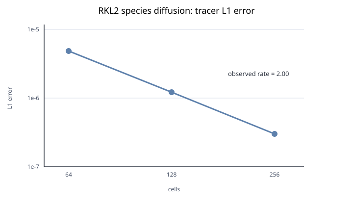

# RKL1/RKL2 组分扩散模

英文原文：[README.md](README.md)。英文版是唯一规范文本；若中英文内容不一致，以英文版为准。

> CPU 状态：通过。CUDA：待完成。

`simulation/DiffusionMode/` 在静态、周期一维理想气体状态中推进有界 tracer 质量分数：

\[
X(x,t)=0.5+0.25\exp[-D(2\pi)^2t]\cos(2\pi x),\qquad D=0.01.
\]

参考包含精确单元平均 sinc 因子。只启用核素扩散，背景分数为 `1-tracer`。已提交的 RKL1 和 RKL2 输入使用 64、128 和 256 个单元，终止于 \(t=0.1\)。

## 复现

环境和构建来源信息与 [hydro 记录](../hydro/README.zh-CN.md)一致。

```bash
export OMP_NUM_THREADS=2
for p in simulation/DiffusionMode/*.par; do
  ./bin/ARCH DiffusionMode "$p"
done
```

RKL2 验收要求最后一对分辨率的 tracer L1 阶数至少 1.8，平均 tracer 漂移不超过 \(10^{-12}\)。RKL1 要求分数有限且有界，Linf 误差不超过 \(10^{-5}\)，并满足相同漂移限制。结果由最终 HDF5 单元平均值测量。

| 积分器 | 单元数 | L1 | L2 | L1 阶数 | 平均漂移 |
| --- | ---: | ---: | ---: | ---: | ---: |
| RKL1 | 64 | 1.714e-6 | 1.903e-6 | — | 0 |
| RKL1 | 128 | 3.567e-7 | 3.962e-7 | 2.265 | 0 |
| RKL1 | 256 | 2.221e-7 | 2.467e-7 | 0.684 | 1.11e-16 |
| RKL2 | 64 | 4.851e-6 | 5.386e-6 | — | 0 |
| RKL2 | 128 | 1.213e-6 | 1.347e-6 | 2.000 | 0 |
| RKL2 | 256 | 3.032e-7 | 3.368e-7 | 2.000 | 5.55e-17 |



两个 CPU 路径均通过。RKL2 序列与二阶空间收敛一致。RKL1 的分辨率/stage 数混合序列用于稳定性、有界性、守恒性和解析误差回归，不测量 RKL1 时间阶数。CUDA 一致性将使用同一解析参考和已提交输入。
