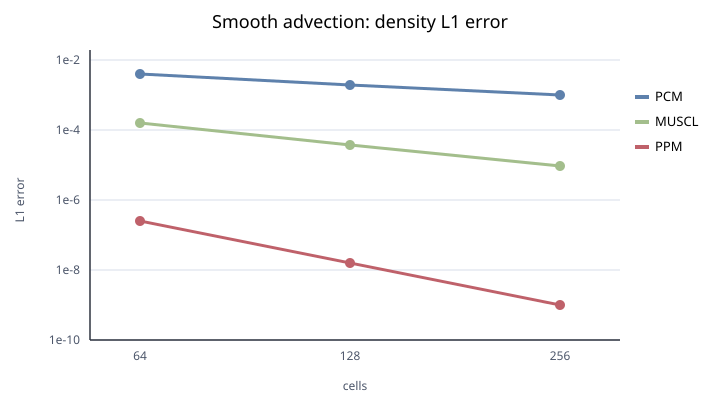

# Hydrodynamics validation

Chinese translation: [README.zh-CN.md](README.zh-CN.md). The English file is
the authoritative source text.

Hydrodynamics describes how fluid motion transports mass, momentum and energy.
The smooth-wave tests measure how accurately a profile travels; Sod and Sedov
test sharp waves and shock positions. Read the errors against each problem's
reference solution before using CPU/CUDA agreement to assess backend consistency.

The results on this page belong to the scientific acceptance snapshot identified
in the [central Validation index](../README.md). Source organization and build
verification have a separate
[maintenance record](../backend/results/maintenance-freeze-20260908/).

CPU and CUDA pass the smooth-wave spatial and temporal accuracy,
Sod, sustained periodic-advection and planar Sedov checks.
Overall acceptance is tracked in the [validation index](../README.md).

## Smooth-wave spatial accuracy

The `SmoothAdvection` implementation remains in `simulation/SmoothAdvection/`;
the immutable parameter files owned by this record are in [`inputs/`](inputs/).
They advect a periodic entropy wave with
\(\rho=1+0.2\sin(2\pi x)\), \(u=1\), and \(p=1\) to \(t=0.1\). The initial and
translated references are exact finite-volume cell averages. HLLC and SSPRK3
are fixed while PCM, MUSCL-MC, and PPM are run at 64, 128, and 256 cells.

### Reproduce

The [application evidence](../backend/results/uniform-native-20260907/release-874/backend-validation-evidence.json)
records the tested source, binaries, dependencies and build settings. Its
fixed-time runs compare both backends with the analytic wave, then with each
other. Use a testing-enabled CUDA build and run from the repository root:

```bash
export OMP_NUM_THREADS=4
python3 tools/validate_backend_results.py \
  --manifest validation/backend/cases.json \
  --arch build-cuda/bin/ARCH \
  --checkpoint-validator build-cuda/arch_cuda_single_level_validation \
  --build-dir build-cuda --source-root . \
  --output-root validation/backend/results/uniform-new
```

The final density cell averages are compared with the analytic wave translated
by \(ut\). [metrics.csv](metrics.csv) retains both backends' L1/L2/Linf, observed L1 rate, and relative mass
drift. All 18 fixed-time results pass. Acceptance is final-pair L1 rate at least
0.9 for PCM, 1.8 for MUSCL, and 2.7 for PPM, with mass drift at most
\(10^{-12}\). PPM additionally requires positive density and energy and L1 no
larger than \(10^{-4}\) at every resolution. The CPU/CUDA comparisons pass with
relative and absolute tolerances of \(2\times10^{-10}\) and \(2\times10^{-12}\).

| Method (CPU and CUDA) | L1 at N=256 | Final L1 rate | Max mass drift | Result |
| --- | ---: | ---: | ---: | --- |
| PCM | 9.780e-4 | 0.994 | 1.22e-14 | pass |
| MUSCL-MC | 9.314e-6 | 2.040 | 1.23e-14 | pass |
| PPM | 9.731e-10 | 3.993 | 1.22e-14 | pass |



The PPM series exceeds its 2.7 acceptance rate after reconstructing pressure
through the selected EOS and retaining smooth extrema. The near-fourth-order
rate belongs to this smooth constant-pressure contact test; it is not a general
fourth-order claim. No positivity or species repair is expected for this state.

## Sod shock tube

The [same application record](../backend/results/uniform-native-20260907/release-874/backend-validation-evidence.json)
passes the Sod checks on both backends at \(t=0.2\), using HLLC, PPM and
SSPRK3 on 64, 128 and 256 uniform Cartesian cells. The ideal gas has
\(\gamma=1.4\); the initial left/right states are
\((\rho,u,p)=(1,0,1)\) and \((0.125,0,0.1)\), separated at \(x=0.5\)
in the unit interval with outflow boundaries.

An independent exact Euler Riemann solution supplies the reference. Quadrature
splits each cell at wave boundaries and averages the analytic density,
velocity, pressure and total-energy density. The acceptance norms below apply
to density; the report also retains the other three profile errors.

| Cells | Density L1 | Density L2 | Original L1 / L2 limits | Shock error (cells) |
| --- | ---: | ---: | ---: | ---: |
| 64 | 4.616e-3 | 9.837e-3 | 0.05 / 0.10 | 0.428 |
| 128 | 2.480e-3 | 6.630e-3 | 0.03 / 0.08 | 0.145 |
| 256 | 1.151e-3 | 4.220e-3 | 0.02 / 0.06 | 0.290 |

CPU and CUDA agree at the shown precision. The two refinement pairs give
density L1 orders of 0.897 and 1.107, and L2 orders of 0.569 and 0.652,
exceeding the original minima of 0.7 and 0.3. Both backends retain positive
density and energy and meet the 2.5-cell shock-position budget at the prescribed
end time. Their field comparison passes with relative/absolute tolerances of
\(5\times10^{-9}\)/\(5\times10^{-12}\). The uniform-matrix command above
reproduces this series and the sustained test below.

## Sustained periodic advection

The record's `hydro_periodic_1000` case advances the 64-cell HLLC/PPM/SSPRK3
entropy wave to \(t=2.05\), completing 1,016 steps on each backend. Density
L1 is \(5.071\times10^{-6}\), within the original \(10^{-3}\) budget.
Absolute mass, longitudinal momentum and total-energy drifts are
\(6.273\times10^{-14}\), \(6.284\times10^{-14}\) and
\(1.821\times10^{-13}\), each below \(10^{-11}\); transverse momentum
remains zero. Density and energy stay positive. CPU/CUDA field comparisons
pass at the same tolerances as Sod, and the recorded CUDA publications have
no unfinished transfers or stale ghost data. This checks accumulated error and
conservation over more than two wave periods on a uniform grid.

## Independent time integration

[time_reference.py](time_reference.py) evolves the same periodic contact with
PCM and compares actual ARCH output with the exact Fourier exponential of its
semi-discrete upwind operator. Holding the mesh fixed separates time error from
spatial error. No production time integrator supplies the expected solution.

The [18-run temporal-accuracy record](results/time-native-20260907/release-879/evidence.json)
passes with CFL values 0.4, 0.2 and 0.1 at the same physical end time,
\(t=0.1\). CPU and CUDA give the same temporal errors and orders:

| Integrator | Observed L1 orders | Required minimum | Result |
| --- | --- | ---: | --- |
| Euler | 1.001566, 0.999922 | 0.9 | pass |
| SSPRK2 | 1.999972, 1.999229 | 1.8 | pass |
| SSPRK3 | 3.000604, 2.999841 | 2.7 | pass |

The largest mass drift, pressure error and velocity error are
\(9.215\times10^{-15}\), \(1.288\times10^{-14}\) and
\(2.887\times10^{-15}\), respectively, within their original \(10^{-12}\)
invariant budgets. Reproduce with a Python environment containing NumPy and h5py:

```bash
python3 validation/hydro/time_reference.py --build-dir build-cuda \
  --output-dir validation/hydro/results/time-new
```

## Planar Sedov blast

The [acceptance record](results/sedov-first-law-20260907/release-889/evidence.json)
passes the same independent strong-shock checks on both backends. It covers a
one-dimensional, two-sided blast on uniform Cartesian grids of 128, 256 and
512 cells, using HLLC, PPM, SSPRK3 and an ideal gas with \(\gamma=1.4\). In the
test's units, ambient density is 1, ambient pressure is \(10^{-5}\), deposited
energy is 1, and the comparison time is 0.1. The initial energy occupies two
cells at each resolution, so refinement approaches the point-explosion limit.

[sedov_reference.py](sedov_reference.py) evaluates the Sedov similarity
solution independently of ARCH's hydro, EOS and time-integration routines.
It checks the reference against published profile values, strong-shock jump
conditions, swept mass and an independently integrated energy normalization.
Comparisons use conserved finite-volume cell averages, with velocity and
pressure derived from those averages. They test density, velocity, pressure
and total-energy density, as well as shock position, reflection symmetry,
mass and energy conservation, and the initially deposited energy.

Profile errors are normalized by post-shock density, shock speed,
\(\rho_0 D_s^2\) and \(E_0/(2R_s)\), respectively, where \(D_s\) and \(R_s\)
are the similarity shock speed and radius. The original acceptance limits
are L1 at most 0.04 and L2 at most 0.10 for every field and resolution, shock
position error at most three cells, and L1 convergence order at least 0.5
between 256 and 512 cells. Relative mass, energy and deposition errors,
scaled symmetry error, and reference quadrature error must each be at most
\(10^{-10}\). Density and pressure must stay positive, with zero transverse
momentum. CPU/CUDA comparisons additionally use relative and absolute
tolerances of \(2\times10^{-8}\) and \(10^{-12}\).

All checks pass. CPU and CUDA give the same values at the reported precision:

| Field | Normalized L1 at N=512 | Normalized L2 at N=512 | Final L1 order |
| --- | ---: | ---: | ---: |
| Density | 2.188e-3 | 8.697e-3 | 0.602 |
| Velocity | 1.958e-3 | 1.137e-2 | 0.737 |
| Pressure | 2.034e-3 | 1.223e-2 | 0.813 |
| Total-energy density | 7.399e-3 | 5.420e-2 | 0.615 |

Across all three resolutions, the largest shock-position error is 0.253
cells. Relative mass and energy drifts stay below \(1.80\times10^{-14}\) and
\(6.53\times10^{-14}\); deposition error is below \(10^{-15}\). The measured
reflection error is zero, and the reference quadrature check is below
\(2.22\times10^{-12}\). These convergence orders describe a blast with a
shock and a shrinking deposition region, separately from the smooth-wave
accuracy measured above.

To reproduce, use a testing-enabled CUDA build and a Python environment with
NumPy, SciPy and h5py. From the repository root, first check the independent
reference, then run both backends into a new output directory:

```bash
python3 validation/hydro/sedov_reference.py --oracle-only
python3 validation/hydro/sedov_reference.py --build-dir build-cuda \
  --output-dir validation/hydro/results/sedov-new
```
